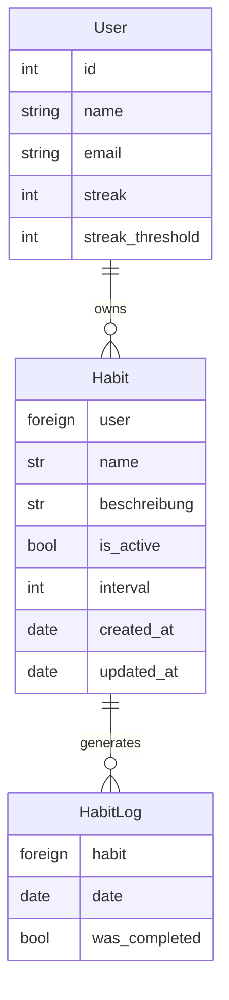

# Habit Tracker API — Design Document

## Goal & Scope

The Habit Tracker API allows users to track their recurring habits in daily life. Users can create accounts, add, edit, and delete habits, and choose their own repetition cycle. Optionally, users can enable streaks, which count and evaluate daily completed habits to determine whether a self-set goal has been reached. The Habit Tracker does not support one-time habits and therefore cannot be used as a ToDo app.

---

## Schema

The Habit Tracker API consists of three entities: User, Habit, and HabitLog.

The `streak` attribute is stored on the User and not in a separate table, as it is simpler to implement and a separate table would provide no meaningful benefit.

`streak_threshold` is optional, allowing the user to decide whether they want to track a streak at all.

When a Habit is deleted, all associated HabitLogs are automatically deleted as well. When a User is deleted, all their Habits (and therefore HabitLogs) are deleted. This was chosen because HabitLog entries have no meaningful value without their Habit foreign key, just as Habits have no meaningful value without their User.

---

## API Endpoints

| Method | Endpoint               | Description                                   |
|--------|------------------------|-----------------------------------------------|
| GET    | /api/v1/habit/         | Returns all habits                            |
| GET    | /api/v1/habit/{id}/    | Returns a specific habit                      |
| POST   | /api/v1/habit/         | Creates a new habit                           |
| PATCH  | /api/v1/habit/{id}/    | Partially updates a habit                     |
| DELETE | /api/v1/habit/{id}/    | Deletes a habit                               |
| POST   | /api/v1/habit/{id}/log/| Marks a habit as completed or missed          |
| POST   | /api/v1/user/register/ | Registers a new user                          |
| POST   | /api/v1/user/login/    | Logs in a user                                |
| POST   | /api/v1/user/logout/   | Logs out a user                               |
| PUT    | /api/v1/user/profile/  | Updates the user profile and streak threshold |

---

## Technical Decisions

**PostgreSQL**: PostgreSQL is the industry standard and optimized for large query volumes. It was also chosen as a learning goal — mastering PostgreSQL with Django is a core objective of this project.

**Django REST Framework**: DRF is purpose-built for REST APIs and comes as part of the Django ecosystem. Django is a full-batteries framework and the intended primary framework for future projects.

**JWT Authentication**: JWT is the industry standard for stateless authentication and is used here to build familiarity for future projects.

**Docker**: Docker ensures the project runs identically on every machine regardless of the operating system. This reproducibility eliminates environment-specific issues during development and deployment.

---

## Open Questions

- Will there be interaction between users (e.g. shared habits, leaderboards)?
- Will an integrated ToDo module be added in the future?
- Will a reverse proxy and server-side cache be implemented?
- Should habit scheduling be based on the user's local timezone or UTC?